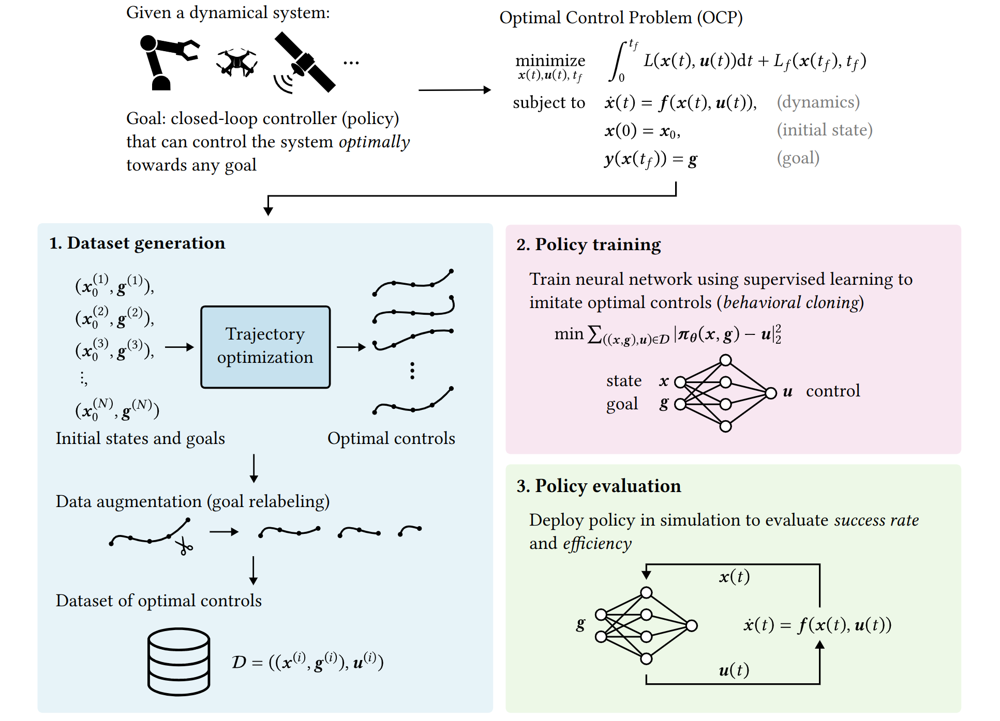

<h1 align="center">
    Learning efficient goal-conditioned policies by imitating optimal trajectories
</h1>
<p align="center">
    Jon Goikoetxea, Jesús F. Palacián
    <br>
    <a href="https://jongoiko.github.io/gcimopt/">[Project page]</a>
</p>
<p align="center">
    
</p>

This repository contains the code necessary to replicate the experiments in the work titled _Learning efficient goal-conditioned policies by imitating optimal trajectories_, defended by Jon Goikoetxea as his Bachelor's thesis in Computer Science.
The thesis was directed by Prof. Jesús F. Palacián and defended at the Public University of Navarre (UPNA/NUP).

## Installation

First, clone the repository:

```shell
git clone https://github.com/jongoiko/gcimopt.git
cd gcimopt
```

Then, create a virtual environment to install the project's dependencies.
We will use Python 3.11;
depending on your package manager of choice, there'll be different methods to set up specific Python versions.
In this example we use `venv` and `pip` and assume that we have Python 3.11 installed as `python3.11`:

```shell
python3.11 -m venv .venv
source .venv/bin/activate
python3 -m pip install --upgrade pip
```

Running the experiments requires the environments in `safe-control-gym`;
clone [their repository](https://github.com/utiasDSL/safe-control-gym) and install it in the virtual environment:

```shell
git clone https://github.com/utiasDSL/safe-control-gym.git
pip install -e ./safe-control-gym
```

We can now install the rest of the dependencies:

```shell
pip install -e .
```

## Replicating the experiments

All experiments consist of generating a dataset of optimal trajectories, training MLP policies on the dataset and then evaluating said policy.
The dataset generation step may be skipped by downloading and unzipping our ZIP file with generated datasets:

```shell
wget https://github.com/jongoiko/gcimopt/releases/download/v0.1.0/data.zip
unzip data.zip
```

Similarly, you can skip policy training by downloading our pre-trained policies:

```shell
wget https://github.com/jongoiko/gcimopt/releases/download/v0.1.0/policies.zip
unzip policies.zip
```

### Dataset generation

For an experiment name (one of `double_integrator`, `cartpole`, `drone2d`, `drone3d` or `robot_reach`), run

```shell
python -m experiments.run +experiment=$EXPERIMENT_NAME generate=true
```

To generate datasets for all experiments, we provide a shell script which may be run directly:

```shell
./generate.sh
```

> The URDF file for the Franka Emika Panda robot is stored in `experiments/resources/fer_franka_hand.urdf` and was generated with [`franka_description`](https://github.com/frankaemika/franka_description).

### Policy training

At this point, there should be a `data` directory with the following structure:

```
data
├── cartpole
│   └── ...
├── double_integrator
│   └── ...
├── drone2d
│   └── ...
├── drone3d
│   └── ...
└── robot_reach
    └── ...
```

To train a policy of a specific architecture for an experiment name, run

```shell
python -m experiments.run +experiment=$EXPERIMENT_NAME +experiment/policy_model=$POLICY_ARCH train=true
```

where `$POLICY_ARCH` corresponds to the name of an architecture configuration in `experiments/config/experiment/policy_model`, such as `mlp_2_32`.

We provide a script `train.sh` to train all policies as specified in the thesis report:

```shell
./train.sh
```

### Policy evaluation

At this point, there should be a `policies` directory with the following structure:

```
policies
├── cartpole
│   └── ...
├── double_integrator
│   └── ...
├── drone2d
│   └── ...
├── drone3d
│   └── ...
└── robot_reach
    └── ...
```

To evaluate a trained policy of a specific architecture for an experiment name, run

```shell
python -m experiments.run +experiment=$EXPERIMENT_NAME +experiment/policy_model=$POLICY_ARCH evaluate=true
```

We provide a script `eval.sh` to train all policies as specified in the thesis report:

```shell
./eval.sh
```

## Adding a new experiment

This section explains how to add a new experiment (i.e. a different dynamical system to be controlled by a trained policy) and also describes the structure of the already included experiments.
We recommend writing the following code in a new `.py` file in the `experiments/` directory;
the files already in that directory (`double_integrator.py`, `cartpole.py`, etc.) can also be used as examples to guide code structure.

### Specifying an OCP

We start by defining all components of an Optimal Control Problem (OCP), which will be passed to the `OCP` class constructor:

- Given the ODE $\dot x = f(x, u)$ describing the system dynamics, the dynamics $f$ should be implemented as a [CasADi function](https://web.casadi.org/docs/#document-function). This function should take two vectors `x` and `u` (in that order, of dimension $n_x$ and $n_u$ respectively) and output a vector with $n_x$ dimensions.
- From the OCP's cost functional $\int_0^{t_f}L(x, u)dt + L_f(x_f, t_f)$, we declare two more CasADi functions: one for the Lagrangian $L$ and another for the Mayer term $L_f$.
The function for $L$ should take two vector inputs `x` and `u` and return a scalar;
the one for $L_f$ should take a vector $x$ and a scalar $t$, and also output a scalar.
Either one of the two terms might be omitted by passing `None` in its place to the constructor, but not both.
- A pair (tuple) of scalars to indicate the lower and upper bounds $[t_{min}, t_{max}]$ for trajectory duration.
- Lower and upper bounds for the system state, as a pair of arrays/lists of $n_x$ dimensions.
- Lower and upper bounds for the controls, as a pair of arrays/lists of $n_u$ dimensions.
- Optionally, a state-to-goal mapping function $y$ implemented as a CasADi function taking a $n_x$-dimensional vector (state) as input and outputting an $n_g$-dimensional output. If not provided, an identity state-to-goal mapping is assumed ($y(x) = x$).

From all these components, we can instantiate an `OCP` as

```python
ocp = OCP(
    dynamics,
    lagrangian,
    mayer,
    time_bounds,
    state_bounds,
    cotrol_bounds,
    state_to_goal,
)
```

### Writing the initial/final state sampling function

To randomly sample initial and final states for dataset generation and policy evaluation, we need to write a function with the signature

```python
def sample_initial_final_states(
    gen: np.random.Generator,
) -> tuple[np.ndarray, np.ndarray]:
    # ...
    return initial, final
```

which, given a NumPy `Generator` object, returns a pair of $n_x$-dimensional arrays (the initial and final states of a trajectory).
We strongly recommend to only use the input `Generator` for random sampling, in order to maintain reproducibility.

### Specifying input/output pre/postprocessing

Neural network inputs and outputs may be preprocessed before training;
also, the output of the NN may have to be postprocessed before being executed as a control on the dynamical system.
We thus need to define four functions:

- `buffer_transform_states_goals`: this function will be called on the states and goals of the dataset before training.
Its signature is

```python
def buffer_transform_states_goals(
    states: jax.Array, goals: jax.Array, params: jax.Array | None, fit: bool
) -> tuple[jax.Array, jax.Array | None]:
    pass
```

It takes a $N$-by- $n_x$ array of states (where $N$ is the number of samples), a $N$-by- $n_g$ array of goals, an optional array of parameters and a Boolean parameter `fit`.
The function should combine and preprocess the states and goals to return an $N$-by- $n_i$ array.
The function will be called twice:
first on the training set, and then on the validation set.
On the first call, `fit` will be set to True:
if we need to fit certain parameters from the training set (such as mean and variance for normalization), this should be done when `fit` is true.
As a second output, the function should then return an array with the fit parameters (or `None` if it is not necessary for preprocessing).
On the second call, `fit` will be `False`, and if parameters were calculated from the first call, they will be passed through the `params` parameter.
Then, the function should transform the states and goals using the parameters fit from the training set.

- `buffer_transform_controls` works exactly the same, except that it is applied to the controls in the dataset.
Its signature is

```python
def buffer_transform_controls(
    controls: jax.Array, params: jax.Array | None, fit: bool
) -> tuple[jax.Array, jax.Array | None]:
    pass
```

- `transform_state_goal` is similar to `buffer_transform_states_goals`, except that it takes a single state and a single goal as input:

```python
def transform_state_goal(
    state: jax.Array, goal: jax.Array, params: jax.Array | None
) -> jax.Array:
    pass
```

- `model_output_to_control` should convert NN outputs to controls that can be applied to the dynamical system.
Thus, it should apply the inverse transformation of `buffer_transform_controls`:

```python
def model_output_to_control(
    model_output: jax.Array, params: jax.Array | None
) -> jax.Array:
    pass
```

where `model_output` is an array containing the NN output for a single state-goal input pair.

### Defining a success indicator function

To decide whether a state reaches a goal up to a certain tolerance, we need to define a function

```python
def goal_reached(state: jax.Array, goal: jax.Array) -> jax.Array:
    pass
```

The function takes a state and a goal as input, and should return a `bool` (or a Boolean Jax array) which is `True` if `state` reaches `goal`, and `False` otherwise.

### Putting it all together

All the aforementioned components are packaged into an `Experiment` object:

```python
experiment = Experiment(
    ocp,
    sample_initial_final_states,
    transform_state_goal,
    model_output_to_control,
    buffer_transform_states_goals,
    buffer_transform_controls,
    goal_reached,
)
```

To perform dataset generation, policy training and evaluation with this experiment, we need to "register" it on `experiment/run.py`.
Thus, at the start of this file, add

```python
from my_new_experiment import experiment as new_experiment

EXPERIMENTS = {
    # ...
    "EXPERIMENT_NAME": new_experiment
}
```

where `EXPERIMENT_NAME` is a human-readable name of your choosing.
We now need to provide configurations for all steps in the method:
in `experiments/config`, create a file `EXPERIMENT_NAME.yaml` specifying the hyperparameters for dataset generation and the training and evaluation of policies.
Make sure to set the `name` attribute in the file to `EXPERIMENT_NAME`, and feel free to use the existing configs as a base to configure your experiment.
See the [Hydra documentation](https://hydra.cc/docs/intro/) for more details about this YAML-based configuration.

Once the experiment is registered and configured, you may run

```shell
python -m experiments.run +experiment=$EXPERIMENT_NAME [options]
```

where `[options]` may contain `generate=true`, `train=true` and/or `evaluate=true` depending on which step(s) of the method you wish to execute.
You can also [override](https://hydra.cc/docs/advanced/override_grammar/basic/) the configurations of the YAML file directly from the command line.
